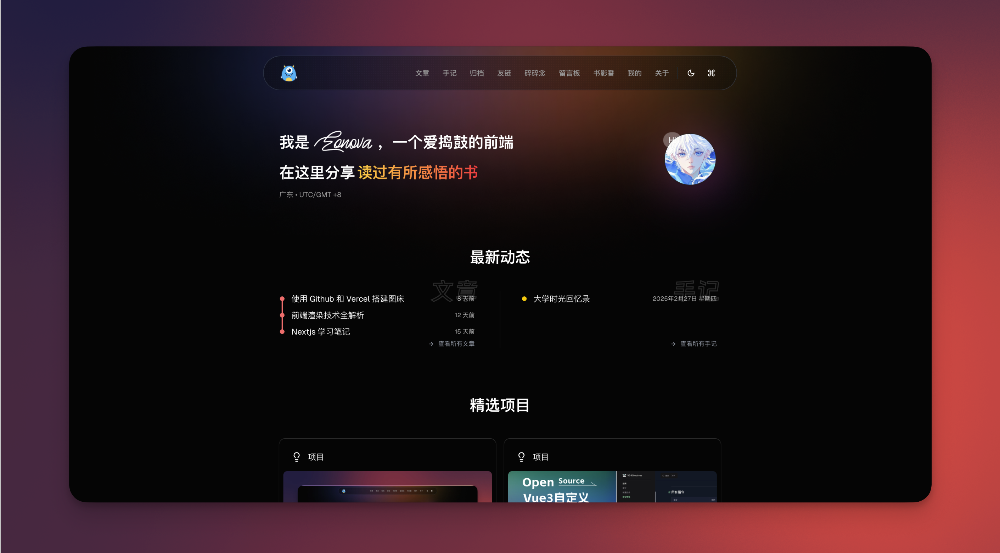
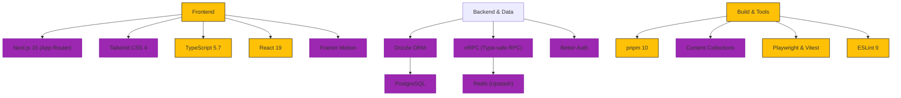

<h3 align="center"> eonova.me </h3>



<div align="center">
  <a href="./README_CN.md"> 🇨🇳 简体中文</a>
  |
  <a href="https://eonova.me"> 👀 preview</a>
</div>

## 🎉 Introduction

A personal blog and portfolio built with modern technology stack, integrating technical article display, open source project management, and rich interactive features.

## 🌌 Features

-   **Content Management**: Blog posts, Notes, Projects, and Photo Album with MDX support.
-   **Interactive Comments**: Nested replies, markdown support, emoji reactions, and email notifications.
-   **Media Experience**: Global music player, masonry photo gallery, and video support.
-   **Social Features**: Guestbook, Friends links, and "Talk" (micro-blogging).
-   **User System**: Authentication (GitHub/Google/Email), Profile management, and Active sessions tracking.
-   **Admin Dashboard**: comprehensive management for content, comments, users, and more.
-   **AI Integration**: AI-powered summary for blog posts.
-   **Performance & SEO**: SSR/ISR, Sitemap, RSS feed, and PWA support.
-   **Search**: Full-text search capability.

## ✨ Tech Stack



## 🚀 Quick Start

### Vercel One-Click Deployment

[](<https://vercel.com/new/clone?repository-url=https%3A%2F%2Fgithub.com%2Feonova%2Feonova.me&env=SITE_URL,SITE_AUTHOR>)

### Docker Compose Deployment

```bash
docker compose up -d
```

## 🖥️ Local Development

### Prerequisites

-   Node.js >= 22
-   pnpm >= 10
-   PostgreSQL
-   Redis

### Setup

```bash
# Install dependencies
pnpm i

# Set up environment variables
cp .env.example .env.local
# Edit .env.local with your credentials

# Database initialization
pnpm db:generate
pnpm db:migrate
pnpm db:seed

# Start development server
pnpm dev
```

### Key Scripts

```bash
# Build production version
pnpm build

# Type checking
pnpm typecheck

# Code linting
pnpm lint

# Database management (Studio)
pnpm db:studio

# Run Unit Tests
pnpm test:unit

# Run E2E Tests
pnpm test:e2e
```

## ☕️ Buy me a coffee

<div align="center">
  
</div>
