<h3 align="center"> eonova.me </h3>


<div align="center">
  <a href="./README_CN.md"> 🇨🇳 简体中文</a>
  |
  <a href="https://eonova.me"> 👀 preview</a>
</div>

## 🎉 Introduction

A personal blog built with modern technology stack, integrating technical
article display, open source project management, and more.

## 🌌 Features

- Comments system
- Like functionality
- Post view counter
- Blog post search
- RSS feed
- Sitemap
- PWA

## ✨ Tech Stack

```mermaid
graph TD
    A[前端框架] --> B["Next.js 15"]
    A --> C["Tailwind CSS 4"]
    A --> D["TypeScript 5.7"]
    D --> E["React 19"]

    G[后端服务] --> H["Drizzle Kit"]
    G --> I["Trpc Server"]
    H --> J["PostgreSQL 16"]
    I --> K["Redis 1.34"]

    L[构建工具链] --> M["pnpm 10"]
    L --> N["Webpack 5"]
    M --> O["ESLint 9"]
    M --> P["TypeScript 编译器"]

    classDef framework fill:#2196F3,stroke:#1976D2;
    classDef service fill:#FFC107,stroke:#000;
    classDef build fill:#9C27B0,stroke:#7B1FA2;

    class A,F,D,E,L,N,M,O,P service;
    class B,C,G,H,I,J,K build;
```



## 🚀 Quick Start

### Vercel One-Click Deployment

[](<https://vercel.com/new/clone?repository-url=[https%3A%2F%2Fgithub.com%2Fhamster1963%2Fnextme&env=SITE_URL,SITE_AUTHOR](https://github.com/eonova/eonova.me)>)

### Docker Compose Deployment

```bash
docker compose up -d
```

## 🖥️ Local Development

Local development setup

```bash
# Install all dependencies
pnpm i

# Start development server (with 3000 processes in parallel)
pnpm dev --p 3000

# Build production version
pnpm build

# Database initialization
pnpm db:migrate
pnpm db:seed
```

Key scripts

```bash
# Update dependencies
pnpm deps:up

# Check dependencies
pnpm check:knip

# Code quality check
pnpm lint

# Database operations
pnpm db:studio # Database management

# Analyze build package
pnpm bundle-analyzer
```

## ☕️ Buy me a coffee

<div align="center">
  
</div>
