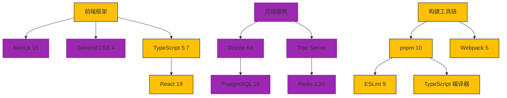

<h3 align="center"> eonova.me </h3>


<div align="center">
  <a href="./README.md"> 🇺🇸 English</a>
  |
  <a href="https://eonova.me"> 👀 预览</a>
</div>

## 🎉 项目介绍

基于现代化技术栈构建的高性能个人博客，集成技术文章展示、开源项目管理等能力

## 🌌 核心特性

- Comments system
- Like functionality
- Post view counter
- Blog post search
- RSS feed
- Sitemap
- PWA

## ✨ 技术栈



## 🚀 快速部署

### Vercel 一键部署

[](https://vercel.com/new/clone?repository-url=[https%3A%2F%2Fgithub.com%2Fhamster1963%2Fnextme&env=SITE_URL,SITE_AUTHOR](https://github.com/eonova/eonova.me))

### Docker Compose 部署

```bash
docker compose up -d
```

## 🖥️ 本地启动

本地运行准备

```bash
# 安装全部依赖
pnpm i

# 启动开发服务器（带3000进程并行）
pnpm dev --p 3000

# 构建生产版本
pnpm build

# 数据库初始化
pnpm db:migrate
pnpm db:seed
```

关键脚本说明

```bash
# 依赖更新
pnpm deps:up

# 依赖检查
pnpm check:knip

# 代码质量检查
pnpm lint

# 数据库操作
pnpm db:studio # 图形化数据库管理

# 分析构建包
pnpm bundle-analyzer
```

## ☕️ 请我喝咖啡

<div align="center">
  
</div>
