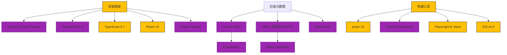

<h3 align="center"> eonova.me </h3>


<div align="center">
  <a href="./README.md"> 🇺🇸 English</a>
  |
  <a href="https://eonova.me"> 👀 预览</a>
</div>

## 🎉 项目介绍

基于现代化技术栈构建的高性能个人博客与作品集，集成了技术文章展示、开源项目管理、相册以及丰富的交互功能。

## 🌌 核心特性

-   **内容管理**：支持 MDX 的博客文章、笔记、项目展示和相册。
-   **交互式评论**：支持嵌套回复、Markdown 语法、表情回应以及邮件通知。
-   **媒体体验**：全局音乐播放器、瀑布流图片画廊和视频支持。
-   **社交功能**：留言板、友情链接以及“说说”（Talk）微动态。
-   **用户系统**：支持 GitHub/Google/Email 登录，个人资料管理及活跃会话追踪。
-   **管理后台**：全功能后台，可管理内容、评论、用户等。
-   **AI 集成**：基于 AI 的文章摘要生成。
-   **性能与 SEO**：SSR/ISR 渲染，自动生成 Sitemap 和 RSS，支持 PWA。
-   **搜索**：全文搜索能力。

## ✨ 技术栈



## 🚀 快速部署

### Vercel 一键部署

[](<https://vercel.com/new/clone?repository-url=https%3A%2F%2Fgithub.com%2Feonova%2Feonova.me&env=SITE_URL,SITE_AUTHOR>)

### Docker Compose 部署

```bash
docker compose up -d
```

## 🖥️ 本地开发

### 环境要求

-   Node.js >= 22
-   pnpm >= 10
-   PostgreSQL
-   Redis

### 启动步骤

```bash
# 安装依赖
pnpm i

# 配置环境变量
cp .env.example .env.local
# 编辑 .env.local 填入你的配置

# 数据库初始化
pnpm db:generate
pnpm db:migrate
pnpm db:seed

# 启动开发服务器
pnpm dev
```

### 关键脚本

```bash
# 构建生产版本
pnpm build

# 类型检查
pnpm typecheck

# 代码检查
pnpm lint

# 数据库管理 (Studio)
pnpm db:studio

# 运行单元测试
pnpm test:unit

# 运行 E2E 测试
pnpm test:e2e
```

## ☕️ 请我喝咖啡

<div align="center">
  
</div>
